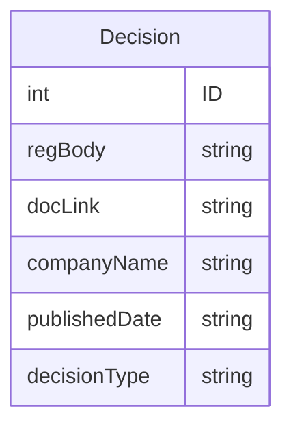

### CISRO data view:

#### Description: An easy-to-use interface for CISRO's data feeds on disciplinary decisions directed at insurance brokers across Canada.

#### Models:



### List of routes:
#### Backend routes:


### Route Table
| Endpoint | Method | Description |
| -------- | -------- | -------- |
| /decisions | GET | brings user to the homepage where they're able to create new decision or search for one 
| /decisions/:id | GET | brings user to a specific decision based on their selection
| /decisions | POST | creates a new decision |
| /decisions/:id | PUT | updates a specific decision based on the ID |
| /decisions/:id | DELETE | deletes a decision based on ID | 


#### List for frontend routes

```
    App --> Header
    App --> Outlet
    Outlet -- "/" --> Index 
    Outlet -- "/:id" --> Show
    Outlet -- "/update/:id" --> updateAction
    Outlet -- "/delete/:id" --> deleteAction
    Outlet -- "/create" --> createAction
```

#### Component Architecture:


#### Webdesign Mockup:

#### Index Page:


#### Create Page


#### Show Page


#### Edit Page


#### Technologies Used:
Backend:
PostgreSQL
Python
Django

Frontend:
React 
Javascript